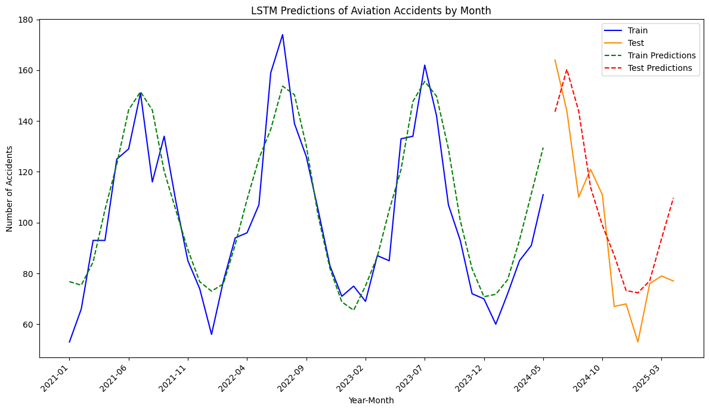

# 🎯 Aviation Safety Predictive Analysis

---

## 📜 Table of Contents
- [📖 Project Overview](#-project-overview)
- [📊 Dataset Collection \& Cleaning](#-dataset-collection--cleaning)
- [✨Exploratory Data Analysis](#exploratory-data-analysis)
- [⚙️ Methodology \& Analysis Pipeline](#️-methodology--analysis-pipeline)
- [📈 Results](#-results)
- [🚀  Conclusion](#--conclusion)
- [🏗️ Future Work](#️-future-work)
- [📌 Repository Organization](#-repository-organization)

---

## 📖 Project Overview

This project analyzes aviation accident data from the National Transportation Safety Board (NTSB) to better understand the factors behind serious incidents. In an industry where safety is paramount, uncovering even subtle patterns can make a real difference.

Our work involves three key tasks:

1. **Injury Severity Prediction**: Classify injury proportions into three categories (minor/serious/fatal)
2. **Aircraft Damage Assessment**: Predict aircraft damage category (minor/serious/destroyed)
3. **Accident Forecasting**: Forecast future accident counts using time-series methods

By combining these approaches, the project aims to highlight the conditions most associated with severe outcomes. The insights gained can support data-informed decisions by regulators, manufacturers, and airline operators to improve safety practices, save lives, and prevent aircraft damage.

## 📊 Dataset Collection & Cleaning

We used `mdb-tools` to convert the `.mdb` database into `.csv` files. These files represented different levels—event, aircraft, and sub-aircraft. We merged them into a unified dataset with one entry per aircraft by propagating event-level data and aggregating sub-aircraft-level data.

Key preprocessing steps included:

- **Missing data**:
  - Dropped columns with >20% missing values
  - Imputed numerical values
  - Added "other/unknown" for sparse categorical values
  - Dropped rows where appropriate

- **Categorical simplification**:
  - Grouped similar categories manually
  - Merged rare values (<1% frequency) into "other/unknown"
  - Applied one-hot encoding

- **Feature engineering**:
  - Created new features (e.g., time since last inspection)

- **Data splitting**:
  - Split into training and test sets for robust evaluation

We modeled three outcomes:

- Proportion of people onboard **fatally injured**
- Proportion of people onboard **seriously injured**
- Aircraft **damage level** (minor / serious / destroyed)

Injury proportions were used instead of raw counts to normalize across aircraft sizes.

---

## ✨Exploratory Data Analysis

**Aviation accidents by month**

**Aviation accidents heatmap:**

[Click to view interactive map](https://raw.githack.com/TheErdosInstitute-Summer2025-Project/aviation-project/main/img/heatmap.html)

[Click to view interactive map](https://raw.githack.com/TheErdosInstitute-Summer2025-Project/aviation-project/main/img/interactive_heatmap.html)

---

## ⚙️ Methodology & Analysis Pipeline

**Data splitting**:
  - 60:20:20 train/validation/test split
  - Stratified by damage category
  - Grouped by event to avoid data leakage

For each target variable, we trained and tuned the following ensemble models:

- **Bagging**
- **Random Forest**
- **Extra Trees**
- **XGBoost**
- **Histogram Gradient Boosting**

Hyperparameters were tuned using grid search with cross-validation on the training set—minimizing MSE for regression tasks and maximizing macro-averaged F1 for the imbalanced classification task. Final model selection was based on validation performance, after which the chosen model was retrained on the combined training and validation sets.

We built a time series forecasting pipeline using an LSTM model to predict monthly accident counts based on past data. The model captures temporal trends in the data and generates future estimates, with mean absolute error (MAE) used to evaluate prediction accuracy.

---

## 📈 Results

For the **regression tasks** (fatal and serious injury proportions), the **Histogram Gradient Boosting** model achieved the lowest validation MSE—with separate hyperparameters for each target:

- **Fatal injuries**:
  - Test MSE: **0.114** vs. baseline MSE: **0.133** → **14% improvement**
- **Serious injuries**:
  - Test MSE: **0.075** vs. baseline MSE: **0.077** → **2.5% improvement**

For the **classification task** (aircraft damage level), the **Extra Trees** model achieved the highest macro-averaged F1 on the validation set:

- Test macro-F1: **0.459** vs. baseline (majority class) macro-F1: **0.316**

For the **time series prediction**, the **LSTM** model achieved 16.65 MAE.

---

## 🚀  Conclusion

Taken together, our models all appear to indicate that the features included across the various NTSB datasets are not particularly predictive of the severity of an aircraft incident, nor the proportion of serious and fatal injuries in aircraft involved in accidents. This analysis illustrates the need for more thorough data collection and entry going forward if the NTSB data is to be used to predict aviation accident severity. 

---

## 🏗️ Future Work

While this project provides a strong foundation, there are several directions for future work:

* **Advanced Feature Engineering:** Explore dimensionality reduction techniques like PCA or t-SNE to capture complex relationships between features.

* **Deploy as an Interactive Tool:** Create a web-based dashboard that allows stakeholders to explore the data and test "what-if" scenarios using the final model.

## 📌 Repository Organization

The main scripts are in the top level 
 - 01_ntsb_table_join.py: Combines all data into a single table, drops data outside the scope of our problem, and does train/validation/test split.
 - 02_ntsb_data_cleaning.py: Cleans training, validation, and test data.
 - 03a_modeling_damage.py: Models damage proportions with several ensemble models, tunes hyperparameters via cross-validation, saves best parameters and model performances on train and validation sets to file.
 - 04a_modeling_injury_proportion_trainval.py: Models injury proportions with several ensemble models, tunes hyperparameters via cross-validation, saves best parameters and model performances on train and validation sets to file.
 - 04b_modeling_injury_proportion_trainval.py: Runs the best injury proportion model on the test set.
 
'data' directory contents:
  - Subdirectories with raw NTSB data, cleaned NTSB data, t-100 data
  - It also has two files explaining the NTSB data: a codemap of all variables in the NTSB database
  - Detailed definitions of how injuries and aircraft damage are categorized.
 
'results' directory contents:
  - Parameters of best models obtained from grid search cross-validation
  - Plots of final model performance
  - Plots of feature importance in final model
 
'deliverables' directory contents:
  - Executive summary
  - Presentation slides
  - Previous project checkpoints.
 
'jupyter_notebooks' directory:
 - Notebooks for exploratory data analysis, model testing, and preliminary versions of code that went into the scripts.
